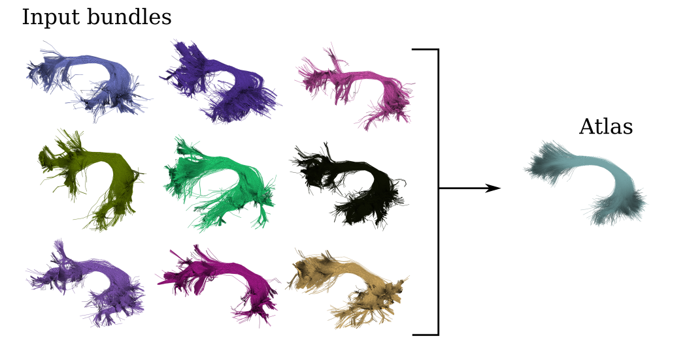

  

# streamlines-gsoc

Experiments and code snippets related with the GSoC 2021 project: **Population-specific tractography bundle atlas creation**

**Student:** David Romero Bascones\
**Mentors:** Bramsh Qamar Chandio, Shreyas Fadnavis and Jong Sung Park\
**Organization:** DIPY (INCF)

**Goal of the project:** to develop a workflow that, given a set of segmented bundles as input, constructs a bundle atlas representative of that population (see Figure with the left arcuate fasciculus as example).

  

The developed workflow can be found [here](https://github.com/dipy/dipy/pull/2425).

Two datasets were used for benchmarking:
- [PPMI:](https://nih.figshare.com/articles/dataset/DIPY_Processed_Parkinson_s_Progression_Markers_Initiative_PPMI_Data_Derivatives/12033390) 30 segmented bundles of 32 healthy controls released along with [Chandio et al., 2020.](https://doi.org/10.1038/s41598-020-74054-4)
- [HCP-10:](https://zenodo.org/record/1477956#.YQuJ0jqxXJU) 72 segmented bundles of 10 HCP controls. Released along with [Wasserthal et al., 2018.](https://doi.org/10.1016/j.neuroimage.2018.07.070)

Content of the notebooks:
- Atlasing
  - [Discrete bundle atlas construction](https://github.com/drombas/streamlines-gsoc/blob/main/code/atlasing/prob_atlas.ipynb)
  - [Probabilistic bundle atlas construction](https://github.com/drombas/streamlines-gsoc/blob/main/code/atlasing/prob_atlas.ipynb)
- Halfway Streamline Linear Registration
  - [Demonstration](https://github.com/drombas/streamlines-gsoc/blob/main/code/hslr/hslr_demo.ipynb)
  - [Comparison with SLR](https://github.com/drombas/streamlines-gsoc/blob/main/code/hslr/hslr_experiment.ipynb)
  - [SLR optimization symmetry](https://github.com/drombas/streamlines-gsoc/blob/main/code/hslr/slr_symmetry_check.ipynb)
- Bundle combination
  - [Demonstration of bundle combination methods](https://github.com/drombas/streamlines-gsoc/blob/main/code/bundle_combination/bundle_combination.ipynb)
  - [Small tests with graph-matching](https://github.com/drombas/streamlines-gsoc/blob/main/code/bundle_combination/graph_matching_demo.ipynb)
  - [Robust streamline averaging](https://github.com/drombas/streamlines-gsoc/blob/main/code/bundle_combination/robust_streamline_averaging.ipynb)
